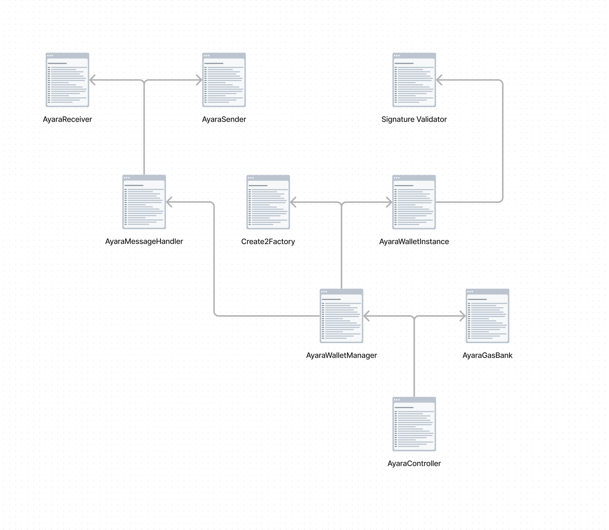

# Ayara Wallet

> Developed for Chainlink Hackathon 2023

## Introduction

Ayara Wallet is a smart contract wallet designed to simplify the use of Layer 2 (L2) networks and other blockchain networks. It eliminates the need for users to acquire or bridge native gas tokens.

The wallet operates by using a relayer to pay gas fees with Link tokens. Users simply deposit Link tokens into the wallet, which are then used to cover gas fees. When a user initiates a transaction, the wallet sends a request to the relayer to process the transaction. The relayer executes the transaction.

A key feature of Ayara Wallet is its support for cross-chain transactions. It enables transactions across any L2 or other networks without the need for users to acquire or bridge native gas tokens. This is achieved through Chainlink's Cross Chain Interoperability Protocol (CCIP).

When a cross-chain transaction is initiated, it starts from the network where the user's Link tokens are staked. This action locks some of the Link tokens in the wallet and sends a message to the target network. A new smart contract wallet (Ayara Instance) is created on the target network, an allowance is set for the user to spend on subsequent transactions, and the execution of the smart contract call continues. All these steps occur within a single transaction.

The user can then execute transactions on the target network. To unlock the Link tokens, the user can send a transaction back to the original network.

## Features

- Chrome extension wallet
- Creates a new EOA wallet with Google sign-in (we use web3auth as a signer), this is the owner of the smart contract wallet.
- Create a smart contract wallet account.
- Lock LINK in the contract (we call it "universal gas tank").
- We use CCIP to create a smart contract wallet account in another chain.

## Project Structure

The project is split into 2 packages:

- `contracts`: contains the smart contracts
- `app`: contains the frontend app including the Relayer

## Smart Contracts

The smart contracts are written in Solidity and tested using Hardhat. The contracts are deployed on Optimism Goerli, Base Goerli and Sepolia testnets.

Ayara Controller is deployed with the same address on all networks. This is important for the creation of Ayara Instances on other networks, since it will create the same address for the same user across all networks.

### The key contracts are:

- `AyaraController.sol`: The main contract that manages the wallet. Entry point for all transactions.
  - `AyaraGasBank.sol`: Contract that manages the gas tokens and logic around allowances and gas usage.
  - `AyaraMessageHandler.sol`: Contract that manages the cross-chain transactions.
    - `AyaraReceiver.sol`: Decoding of the message sent from the source network.
    - `AyaraSender.sol`: Encoding and sending of the message to the target network.
  - `AyaraWalletManager.sol`: Contract that manages the creation of Ayara Instances.
- `AyaraInstance.sol`: The smart contract wallet account. It is created on the target network when a cross-chain transaction is initiated.

### Other contracts in lib/:

- `Create2Factory.sol`: Contract that creates a new smart contract wallet with a deterministic address.
- `PriceConver.sol`: Contract that converts Link tokens to ETH and vice versa. Relayer can use this to determine the amount of Link tokens to charge for a transaction.
- `SignatureValidator.sol`: Contract that validates the signature of the user.
- `Structs.sol`: Contract that defines the structs used in the contracts.

### Mocks used for testing:

- `CCIPRouterMock.sol`: Mock CCIP router used for testing, imitates the CCIP router and allows to test cross-chain transactions on a local network on the same chain.
- `MockERC20.sol`: Mock ERC20 token used for testing.
